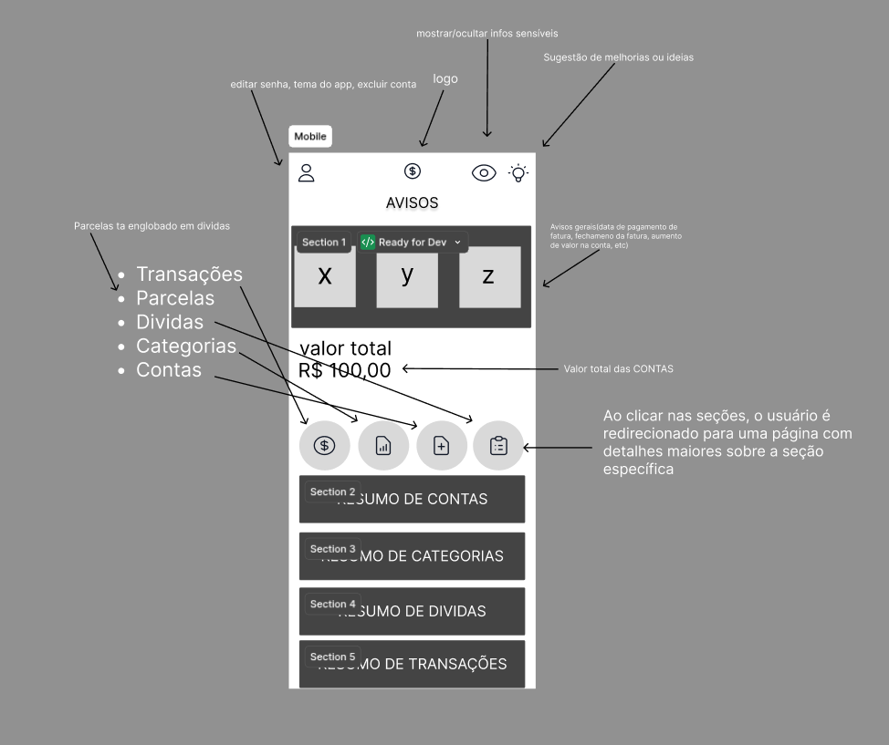
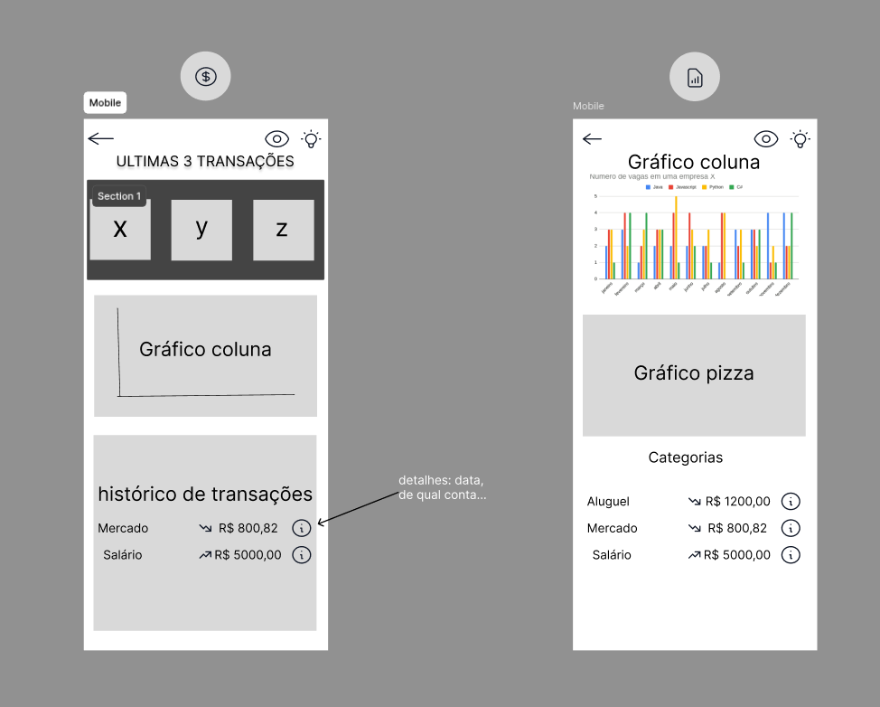
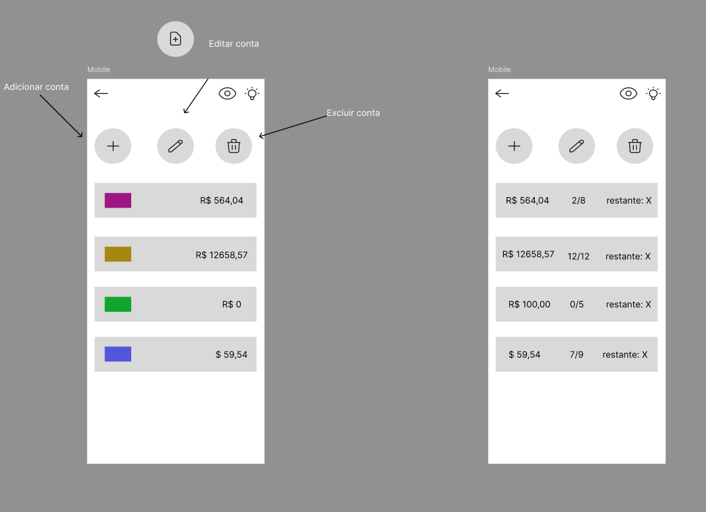

# 💰 Mini Finanças

Aplicação Full Stack de controle financeiro pessoal, com foco em cadastro de usuários, registro de entradas e saídas, gerenciamento de parcelas, análises de gráficos e criação de cartões/contas.

O objetivo do projeto é oferecer uma solução simples e funcional para gerenciamento de finanças pessoais.

---

## 🚀 Tecnologias Utilizadas

### 🔹 Banco de Dados

- MySQL

### 🔹 Back-end

- Node.js
- Express
- Sequelize
- Dotenv
- Cors

### 🔹 Front-end

- React.js
- React Router DOM
- CSS
- Fetch API / Axios

### 🔹 Ferramentas e Métodos

- Postman
- Git e GitHub
- Figma
- VS Code

---

## 🧩 Funcionalidades Principais

- Cadastro e autenticação de usuários
- Registro e listagem de transações (entradas e saídas)
- Controle de parcelas
- Visualização organizada das finanças pessoais
- Controle de contas e saldos

---

## 🎨 Esboço de Baixa Fidelidade

Antes da implementação visual completa, criei um esboço de baixa fidelidade no Figma para ajudar na definição da estrutura inicial das telas e da navegação do sistema.

Os esboços foram pensados com foco na estrutura das telas, navegação e organização das informações. Detalhes visuais como paleta de cores, refinamento de componentes e identidade visual serão definidos em etapas posteriores do desenvolvimento.

### Dashboard



### Outras telas





---

## 📦 Estrutura do Projeto

```bash
mini-financas/
├── backend/
│   ├── controllers/
│   ├── database/
│   ├── middleware/
│   ├── models/
│   ├── routes/
│   ├── services/
│   ├── src/
│   ├── validators/
│   ├── .env
│   ├── .sequelizerc
│   ├── index.js
│   ├── package-lock.json
│   └── package.json
│
├── frontend/
│   ├── public/
│   ├── src/
│   │   ├── assets/
│   │   ├── components/
│   │   ├── pages/
│   │   ├── services/
│   │   ├── styles/
│   │   ├── App.jsx
│   │   └── main.jsx
│   ├── .gitignore
│   ├── eslint.config.js
│   ├── index.html
│   ├── package-lock.json
│   ├── package.json
│   └── vite.config.js
│
├── docs/
│   └── images/
│
├── .gitignore
└── README.md
```
